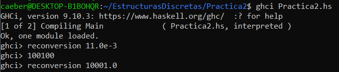
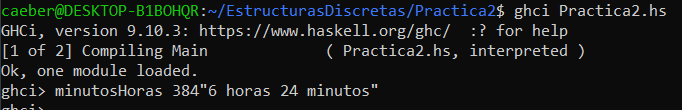
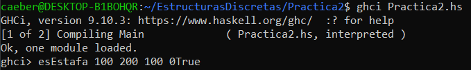
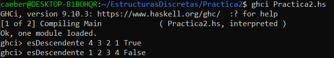
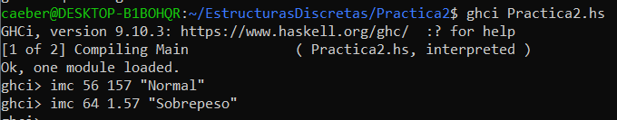
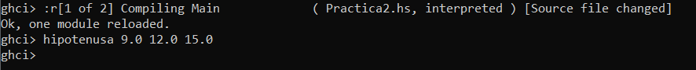
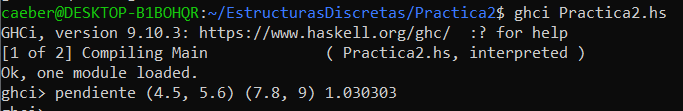
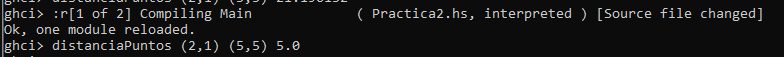

# Practica 2

### Nota
El formato de respuesta de mi promp esta raro, me da las respuestas pegadas a los parametros que yo escribo, llevo mucho tiempo intentando solucionarlo pero aun no lo he logrado :(, aún asi la función está bien.
----

- Función de reconversion

- Función de cashback

Le agregé los 10 puntos para intentar igualar el resultado de la imagen en el documento de la practica 

- Función de cashbackMonto

- Función de minutosHoras

- Función de esEstefa

- Función de esDescendente

- Función de imc

- Función de hipotenusa

- Función de pendiente

- Función de distanciaPuntos

